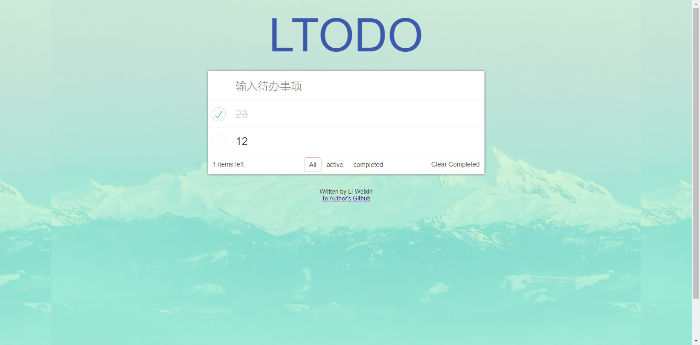

### Vue+webpack打造TODO应用

>此项目基于慕课网Jokcy老师的<a href="https://www.imooc.com/learn/935">Vue+Webpack打造todo应用</a>视频教程编写。

#### 版本：
Vue：2.6.8 
webpack：4.29.6
#### 注意：
在webpack版本4.0.0以上，某些API发生了更改，所以源码和Jokcy老师的会有所不同。

使用webpack4.29.6重新复写demo,如果你是webpack版本4.0.0以上，可以参考一下我的源码。

#### 简介：
此项目首先完成一个前端工程的配置，通过webpack搭建一个完善的vue的workflow.

然后基于Vue实现TODO的简单功能，并涵盖了vue的.vue文件以及jsx的开发模式的了解。

#### 使用方法：

##### 下载源码

    git clone -b LTODO https://github.com/Li-WeiXin/Muke-Pro.git 

##### 安装npm依赖

    npm install

##### 开始项目
进入项目目录

    npm run dev

##### 浏览器预览

    localhost:8000

### 项目说明


```c
Vue-Todolist
└─ TODO
   ├─ .babelrc
   ├─ package-lock.json
   ├─ package.json
   ├─ postcss.config.js
   ├─ README.md
   ├─ src
   │  ├─ app.vue
   │  ├─ assets
   │  │  ├─ images
   │  │  │  ├─ bg.jpg
   │  │  │  ├─ done.svg
   │  │  │  ├─ github.jpg
   │  │  │  ├─ picture.png
   │  │  │  ├─ round.svg
   │  │  │  └─ window.jpg
   │  │  └─ styles
   │  │     ├─ footer.styl
   │  │     ├─ global.styl
   │  │     ├─ test-stylus.styl
   │  │     └─ test.css
   │  ├─ index.js
   │  └─ todo
   │     ├─ footer.jsx
   │     ├─ header.vue
   │     ├─ item.vue
   │     ├─ tabs.vue
   │     └─ todo.vue
   └─ webpack.config.js
```
> 样式clone来自老师
> 跟着老师敲了一遍，业务逻辑还是有些不理解的地方，需要循环巩固。
#### 预览：



